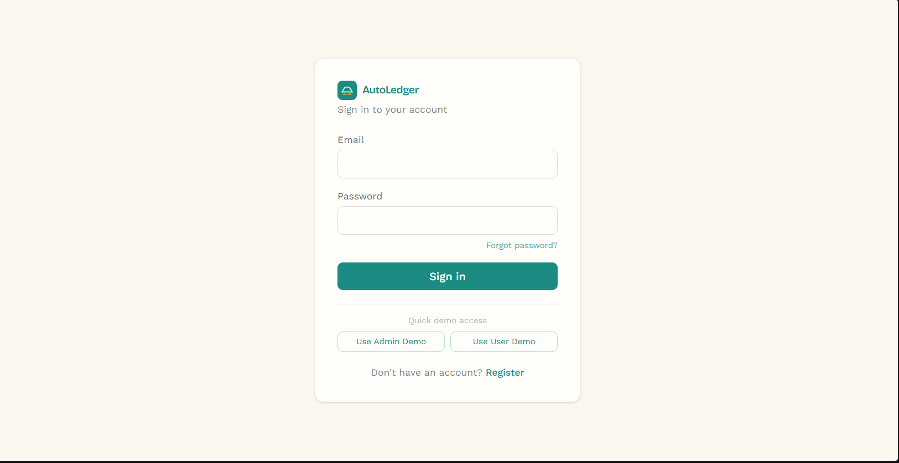
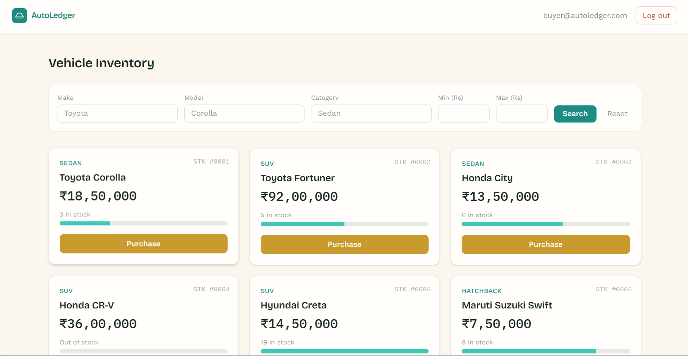
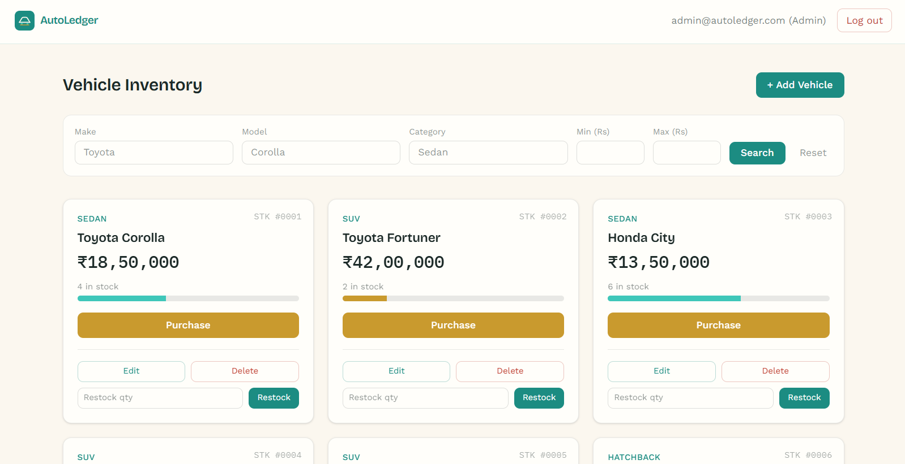
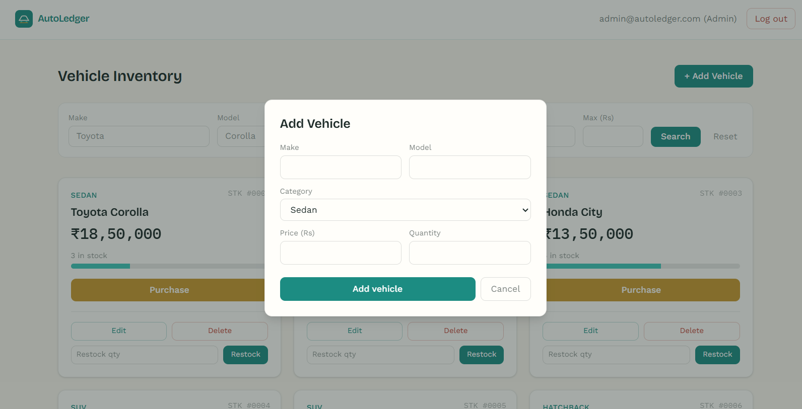
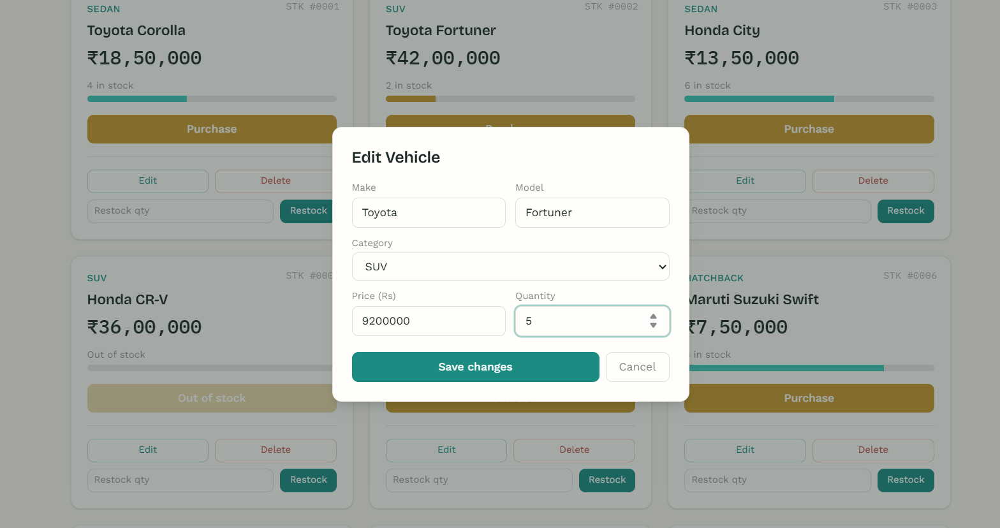

# AutoLedger — Car Dealership Inventory System

A full-stack inventory management system for a car dealership, built as a TDD kata assessment. Users can browse and search available vehicles and purchase them; admins can additionally add, edit, delete, and restock vehicles.

## Tech Stack

**Backend:** Node.js, Express 5, `node:sqlite` (Node's built-in SQLite module), JWT authentication, `bcryptjs` for password hashing, Jest + Supertest for testing.

**Frontend:** React (Vite), React Router, Tailwind CSS v4, `fetch`-based API client with token-based auth context.

### Database Choice

This project uses `node:sqlite`, Node's built-in SQLite module, instead of the `better-sqlite3` npm package.

`better-sqlite3` requires native compilation via `node-gyp`, which failed during local Windows development due to Windows toolchain issues unrelated to the project itself. I therefore switched to Node's built-in `node:sqlite` module to avoid native compilation.

The application uses a real file-based SQLite database rather than an in-memory database, satisfying the assessment's database requirement.

## Project Structure

```text
car-dealership/
├── backend/
│   ├── src/
│   │   ├── controllers/     # HTTP request/response handling
│   │   ├── services/        # Business logic
│   │   ├── middleware/      # JWT authentication + admin role guards
│   │   ├── routes/          # API routes
│   │   └── db/              # Database connection and schema
│   └── tests/
│       ├── unit/
│       └── integration/
│
├── frontend/
│   └── src/
│       ├── pages/            # Login, Register, Dashboard
│       ├── components/       # VehicleCard, SearchBar, VehicleFormModal, etc.
│       ├── context/          # AuthContext
│       └── api/              # Backend API client
│
├── screenshots/
│   ├── 01-login.png.png
│   ├── 02-dashboard-user.png
│   ├── 03-dashboard-admin.png
│   ├── 04-add-vehicle-modal.png
│   └── 05-edit.png.png
│
├── README.md
├── PROMPTS.md
└── TEST_REPORT.md
```

## Setup & Run Locally

### Prerequisites

- Node.js v22.5 or higher (required for `node:sqlite`)
- npm

This project was built and tested with Node.js v24.19.0.

### Backend

```bash
cd backend
npm install
```

Create a `.env` file based on `.env.example`:

```env
PORT=5000
JWT_SECRET=your_jwt_secret_here
```

Then start the backend:

```bash
npm run dev
```

The backend API runs on:

```text
http://localhost:5000
```

### Frontend

Open a second terminal:

```bash
cd frontend
npm install
npm run dev
```

The frontend runs on:

```text
http://localhost:5173
```

Open the frontend URL in your browser.

Use the **Use Admin Demo** or **Use User Demo** buttons on the login page to quickly try both roles, or register a new account manually. New accounts default to the `user` role.

## Demo Credentials

| Role | Email | Password |
|---|---|---|
| Admin | `admin@autoledger.com` | `admin123` |
| User | `buyer@autoledger.com` | `user123` |

## API Endpoints

| Method | Endpoint | Auth | Description |
|---|---|---|---|
| POST | `/api/auth/register` | Public | Register a new user |
| POST | `/api/auth/login` | Public | Log in and receive a JWT |
| POST | `/api/vehicles` | User | Create a vehicle |
| GET | `/api/vehicles` | User | List all vehicles |
| GET | `/api/vehicles/search` | User | Search by make, model, category, and price range |
| PUT | `/api/vehicles/:id` | User | Update a vehicle |
| DELETE | `/api/vehicles/:id` | Admin only | Delete a vehicle |
| POST | `/api/vehicles/:id/purchase` | User | Purchase a vehicle and decrement its quantity |
| POST | `/api/vehicles/:id/restock` | Admin only | Restock a vehicle and increment its quantity |

## Testing

Run the backend test suite with:

```bash
cd backend
npm test
```

The test suite contains 44 tests covering authentication, JWT/admin middleware, vehicle CRUD, search filtering, inventory purchase/restock, zero-stock purchase blocking, and a race-condition guard on the purchase endpoint.

See `TEST_REPORT.md` for the full test output and coverage information.

## What I Prioritized and Why

Given the assessment timeline, I prioritized the following:

1. **Core backend logic with real TDD discipline** — especially the purchase and restock endpoints, since they have meaningful edge cases such as zero-stock blocking, negative-quantity prevention, and a database-level atomic guard against a race condition on the last unit in stock.

2. **Full authentication and role-based access control** — including registration, login, JWT authentication, and admin authorization, since almost every other endpoint depends on these features.

3. **A complete, polished frontend** — covering search/filter, vehicle purchasing, stock indicators, and a full admin interface for adding, editing, deleting, and restocking vehicles.

4. **Design and UX details** — including a custom color and typography system, realistic seed data, a splash screen, and quick demo-login buttons, since the brief explicitly invites creativity and a great user experience.

### Features Not Implemented

Given the assessment timeline, I intentionally did not implement a complete password-reset workflow. The UI includes a **Forgot Password?** option that displays an honest message rather than a simulated reset process, because a real password-reset system would require email infrastructure outside the scope of this assessment.

Pagination was also not implemented because it was not required for the core assessment functionality.

## My AI Usage

**Tools used:** Claude (Anthropic), used throughout via conversational pair-programming for the full build.

### How I Used It

- Scaffolding the RED-GREEN-REFACTOR structure for each backend endpoint. I asked for a failing test first, ran it myself to confirm it failed for the right reason, and then asked for the minimum implementation needed to pass it.

- Debugging real environment issues as they came up, including a Windows `node-gyp` compilation failure with `better-sqlite3`. This was resolved by switching to Node's built-in `node:sqlite`.

- Debugging a SQLite "database is locked" error caused by Jest running test files in parallel processes against the same file-based test database. Test isolation was then adjusted so the tests could run reliably.

- Debugging a corrupted `package.json` caused by a PowerShell heredoc encoding issue.

- Planning the design system. I asked for a distinctive, non-templated visual direction and iterated on the color palette and typography based on my own feedback. The initial direction was a dark graphite theme, but I requested something lighter and more premium-feeling, resulting in the current warm-ivory and teal palette.

- Generating the admin/regular-user conditional UI logic and the atomic database-level guard against the purchase race condition.

### Where I Corrected or Overrode AI Suggestions

I made several design and usability decisions based on my own preferences and the needs of the demo. For the login page, I suggested adding a **Forgot Password?** option and quick demo-access buttons that automatically fill the appropriate admin or user credentials instead of requiring the credentials to be entered manually each time. I also changed the initial dark-graphite visual direction to a lighter warm-ivory and teal color palette because I preferred a cleaner, more modern, and premium feel for the application.

## Reflection

Using AI conversationally, one step at a time with a test-first discipline, allowed me to move quickly without losing track of why each piece of code existed. Every implementation was written in response to a test I had already seen fail, and I verified each result before moving on rather than accepting large blocks of unverified code.

The most valuable use of AI was not simply generating code, but helping debug environment-specific issues such as `node-gyp`, PowerShell encoding, and test isolation. This allowed me to spend more time on the actual application requirements and user experience while still understanding and verifying the changes being made.

## Screenshots

### Login Page



### Regular User Dashboard



### Admin Dashboard



### Add/Edit Vehicle Modal



### Search and Filter



## Live Demo

A live deployment is not currently available.
